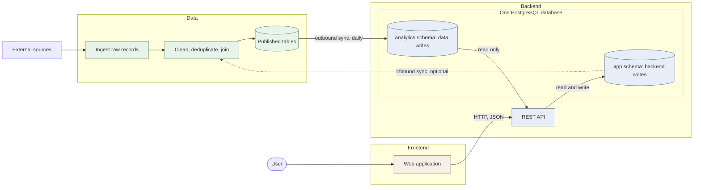

# Loc Events

A Netherlands event-discovery app backed by a Ticketmaster data pipeline: API ingestion, raw storage, dbt transformations, Airflow orchestration and PostgreSQL publishing.

This is my personal portfolio fork of the [HYF Class 55, Group A project](https://github.com/HackYourFutureProjects/c55-final-project-group-A). My role was **data engineering**, working alongside another data engineer, frontend and backend teammates, and HYF mentors.

## My contribution

- **Ticketmaster ingestion:** implemented API integration, validation and pagination. [PR #8](https://github.com/HackYourFutureProjects/c55-final-project-group-A/pull/8)
- **Source coverage:** expanded fetching across five 30-day date windows and deduplicated events by Ticketmaster ID. [PR #97](https://github.com/HackYourFutureProjects/c55-final-project-group-A/pull/97)
- **Reliable publishing:** changed the PostgreSQL refresh to staging, transactional truncate and insert, preserving the existing table and its dependent views, permissions and indexes. [PR #89](https://github.com/HackYourFutureProjects/c55-final-project-group-A/pull/89)
- **Orchestration integration:** connected the backend publishing step to the data workflow. [PR #76](https://github.com/HackYourFutureProjects/c55-final-project-group-A/pull/76)
- **Pipeline monitoring:** customized the supplied Streamlit starter into a read-only health dashboard covering event counts, price coverage, freshness and landing files. [PR #117](https://github.com/HackYourFutureProjects/c55-final-project-group-A/pull/117)

The application and data platform are team work built on HYF-provided foundations. The frontend, backend, infrastructure baseline and other data transformations have their own contributors. See [my contribution notes](docs/my-contributions.md) for the decisions and evidence behind my work.

This is our final project for the [HackYourFuture program](https://hackyourfuture.net/program), built as a
team with three roles: frontend, backend, and data engineering. We worked in an agile way, in short
sprints, supported by a group of mentors: a Product Manager and Tech Leads. The project is open source and available
on GitHub.

### [Team demo](https://c55a.hyf.dev)

This is the team's hosted application, not a separate deployment of this portfolio fork.

[Watch the app demo on YouTube](https://www.youtube.com/watch?v=iIeHOsC3xxw)

---

## Table of contents

- [My contribution](#my-contribution)
- [About the project](#about-the-project)
- [Screenshots](#screenshots)
- [Features](#features)
- [Tech stack](#tech-stack)
- [Architecture](#high-level-architecture)
- [Project structure](#project-structure)
- [Documentation](#documentation)
- [CI/CD](#cicd)
- [Team](#team)
- [Roadmap](#roadmap)

---

## About the project

**Loc Events** is a web app for finding something to do in the Netherlands. Ticketmaster events and events created by
admins land in one feed, so you do not have to check several sites.

Anyone can browse what is on. Signed-in users can save events, mark Going, and get reminded. Admins add and manage
events in the same product.

---

## Screenshots

Screenshots from the team application. Image files live in [`screenshots/`](screenshots).


---

## Features

**Discover events**

- Search by title, description, city, or category
- Filter by category, date range, distance, free/paid, and time of day
- Sort by soonest, popularity, or price

**Event page**

- Description, or a link to the organizer for imported events
- Date, price, and how many people are going
- Map of the address
- Weather at start time
- Similar events
- Comments
- Ask-a-question chat (what it is, the weather, how to get there)
- Save an event or mark Going (signed in)

**Notifications**

- Reminder about a day before an event you marked Going
- Cancel and update alerts for events you saved or are going to
- Notice when an admin replies to your comment

**Accounts and admin**

- Sign in with email or Google
- Profile with Saved and Going
- Admins create, edit, and cancel events, and read feedback

---

## Tech stack

| Layer              | Technologies                                                      |
|--------------------|-------------------------------------------------------------------|
| **Frontend**       | Next.js, React, TypeScript, Biome                                 |
| **Backend**        | Java 25, Spring Boot, PostgreSQL, Flyway, Maven                   |
| **Data**           | Python, SQL, dbt, PostgreSQL, Databricks, Airflow                 |
| **Infrastructure** | Docker, Docker Compose, GitHub Actions, GitHub Container Registry |

## High-level Architecture

Three tracks, three layers, and one database where two of them meet.



The application database holds two schemas. **`analytics`** is written by the
data pipeline and read by the backend. **`app`** holds accounts, saved items and
anything the application's own admins create, and only the backend writes it.

The architecture follows three principles:

- **The two schemas have two owners.** The data pipeline writes `analytics` and
  nothing else. The backend writes `app` and nothing else. Neither side has
  permission to write the other's, which is enforced by two database roles
  rather than by everyone remembering.
- **The data track publishes finished tables, not raw material.** The backend
  should be able to fill a screen with one `SELECT`, without joining sources or
  knowing where a row came from.
- **Records the application creates stay on the application's side.** If an
  admin adds a record by hand and the same thing later arrives from an external
  source, deciding they are the same thing is application logic. It happens
  behind the API, not in the pipeline.

## Project structure

```
.
├── backend/            Spring Boot REST API (Java, Maven, Flyway)
├── frontend/           Next.js web app (TypeScript, React)
├── data/               Data pipeline (Python, dbt, Airflow)
├── scripts/            Scripts for local development and deployment
├── screenshots/        Images used in this README
├── .github/workflows/  CI/CD pipelines and other workflows
```

## Documentation

| What                        | Where                                                                  |
|-----------------------------|------------------------------------------------------------------------|
| My contribution notes       | [`docs/my-contributions.md`](docs/my-contributions.md)                 |
| Frontend guide              | [`frontend/README.md`](frontend/README.md)                             |
| Backend guide               | [`backend/README.md`](backend/README.md)                               |
| Data pipeline guide         | [`data/README.md`](data/README.md)                                     |
| Event similarity            | [`backend/docs/event-similarity.md`](backend/docs/event-similarity.md) |
| Notifications               | [`backend/docs/notifications.md`](backend/docs/notifications.md)       |
| Event list & detail         | [`backend/docs/events.md`](backend/docs/events.md)                     |
| Live API reference (Scalar) | https://c55a.hyf.dev/api/docs                                          |

## CI/CD

The repository includes three component CI/CD workflows:

| Workflow                                                | Triggers on                 | What it does                                                        |
|---------------------------------------------------------|-----------------------------|---------------------------------------------------------------------|
| [Backend CI/CD](.github/workflows/backend-ci-cd.yaml)   | changes under `backend/**`  | Checkstyle, tests, Docker build; pushes the image to GHCR on `main` |
| [Frontend CI/CD](.github/workflows/frontend-ci-cd.yaml) | changes under `frontend/**` | Lint, build, Docker build; pushes the image to GHCR on `main`       |
| [Data CI/CD](.github/workflows/data-ci-cd.yaml) | changes under `data/**` or its workflow | Python/SQL checks, tests, DAG imports; builds and publishes the ingestion image to ACR in the team deployment setup |

These workflows describe the team's deployment setup. Azure deployment from a personal fork requires its own authorized configuration; the fork does not automatically inherit the team's deployment access.

## Team

| Name             | Role             | GitHub                                                         |
|------------------|------------------|----------------------------------------------------------------|
| Diana Chukhrai   | Frontend         | [@dianadenwik](https://github.com/dianadenwik)                 |
| Shadi Abedinpour | Backend          | [@shmoonwalker](https://github.com/shmoonwalker)               |
| Yana Pechenenko  | Backend          | [@YanaP1312](https://github.com/YanaP1312)                     |
| Pavel Tisner     | Data engineering | [@pavel-tisner](https://github.com/pavel-tisner)               |
| Mohammed Alfakih | Data engineering | [@mohammedalfakih-dev](https://github.com/mohammedalfakih-dev) |

**Mentors**

| Name           | Role                 |
|----------------|----------------------|
| Dickson Chu    | Product Manager      |
| Sami Haddad    | Tech Lead — frontend |
| Stas Seldin    | Tech Lead — backend  |
| Lasse Benninga | Tech Lead — data     |

## Roadmap

- [ ] More event sources besides Ticketmaster
- [ ] Recommendations based on what you saved or marked Going, not only similar events
- [ ] A clearer admin role, with tighter app logic and design

---

Thanks to [HackYourFuture](https://hackyourfuture.net/program) for the programme, the mentors, and the space to build
this.
